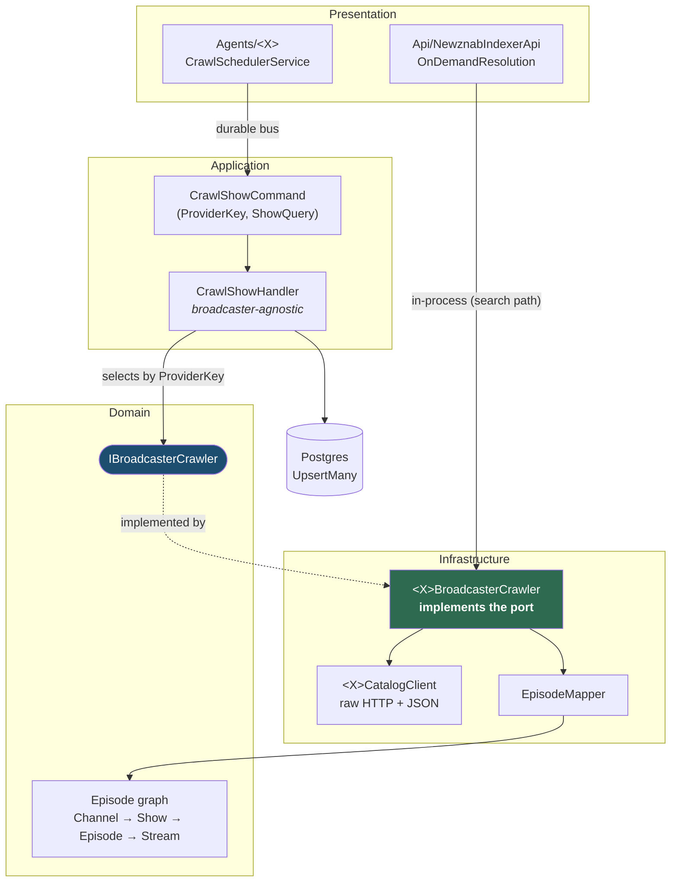

# Adding a broadcaster

Krautwatch's catalog is built entirely by per-broadcaster crawlers behind one port,
`IBroadcasterCrawler`. Adding ORF, SRF, arte or any other Mediathek is therefore a **bounded,
reviewable unit of work**: one HTTP client, one adapter, one host, and a handful of registrations.

This walkthrough follows ZDF, the simplest of the three that exist. Read
[DR-009](architecture/DR-009-architecture-reset.md) (layering) and
[DR-011](architecture/DR-011-search-driven-indexing.md) (why search is query-driven) if you want the
reasoning behind the shape.

## The shape



Two callers, one port. The **agent** crawls a standing list on a schedule (the RSS feed's input);
the **Newznab host** resolves an unseen query live when Sonarr searches for something nobody has
crawled. Both go through your adapter, which is why registering in only one of them is the classic
way to ship a broadcaster that half-works.

`CrawlShowHandler` never learns your broadcaster's name — it picks the crawler whose `ProviderKey`
matches the command and hands you the query string.

## The port

```csharp
public interface IBroadcasterCrawler
{
    /// The catalog scope this crawler serves — matches Channel.ProviderKey.
    string ProviderKey { get; }

    /// Crawl one show by (a substring of) its title. Empty list when it can't be found.
    Task<IReadOnlyList<Episode>> CrawlShowAsync(string showQuery, CancellationToken ct = default);
}
```

`Domain/Interfaces/IBroadcasterCrawler.cs` — the whole contract. You return **fully-formed `Episode`
graphs** (Show + Channel + Streams attached) ready to upsert; nothing downstream does further
enrichment.

## Step 1 — the catalog client

`src/Infrastructure/Crawling/<X>/<X>CatalogClient.cs`. A typed `HttpClient` that speaks the
broadcaster's API and returns *broadcaster-shaped* records — not Domain entities. It is the only
place that knows about their JSON.

Model it on `ZdfCatalogClient`, which does three things:

1. **Search** — `SearchEpisodesAsync(query)` → the episodes matching a show title.
2. **Resolve a stream** — follow whatever indirection the broadcaster uses (ZDF: episode doc →
   `ptmd-template` → PTMD `priorityList` → progressive MP4) and pick the **best progressive MP4**.
   HLS is acceptable if that's all they publish: the Downloader dispatches on the URL — anything
   containing `.m3u8` gets an ffmpeg remux (`-c copy`), everything else a raw byte copy — so no
   flag is needed from you. (`EpisodeMapper` labels every stream `mp4` regardless; the label is
   cosmetic, the URL is what routes.) Progressive is still preferred: it's a copy, not a remux.
3. **Fetch detail** — `FetchEpisodeDetailAsync(hit)` → an `EpisodeDetail`, the normalized shape
   every broadcaster converges on:

```csharp
public sealed record EpisodeDetail(
    string Title,
    string Show,
    string Broadcaster,
    DateTimeOffset? AirDate,
    TimeSpan Duration,
    string? Synopsis,
    string? StreamUrl,           // progressive MP4 (preferred)
    string? SubtitleUrl,         // webvtt, if available
    bool GeoRestricted = false); // in-region-only per the broadcaster's own metadata
```

Two fields are easy to leave null and shouldn't be:

- **`SubtitleUrl`** (#20) — if the broadcaster publishes a WebVTT track, carry it. The Downloader
  saves it as `{video}.de.vtt` on a best-effort basis: a missing subtitle never fails the video.
- **`GeoRestricted`** (#45) — take it from *their* metadata (ARD's `isGeoBlocked`, ZDF's
  `attributes.geoLocation` where anything but `"none"` counts), never from guesswork. It routes the
  download through a German egress proxy, and a job flagged wrongly either fails fast for no reason
  or tries a direct fetch that 403s.

**API keys.** A static key the broadcaster ships in their own public player (like ZDF's `Api-Auth`
bearer) can live in the client as a `const` with a comment saying it rotates — see #13. Anything
user-specific belongs in configuration, never in source.

## Step 2 — the crawler adapter

`src/Infrastructure/Crawling/<X>/<X>BroadcasterCrawler.cs`. Thin: orchestrate the client's calls and
map through `EpisodeMapper`.

```csharp
public sealed class ZdfBroadcasterCrawler(ZdfCatalogClient client) : IBroadcasterCrawler
{
    public string ProviderKey => "zdf";

    public async Task<IReadOnlyList<Episode>> CrawlShowAsync(string showQuery, CancellationToken ct = default)
    {
        var hits = await client.SearchEpisodesAsync(showQuery, ct);
        if (hits.Count == 0) return [];

        var channel = EpisodeMapper.Channel("zdf", "ZDF");
        var episodes = new List<Episode>(hits.Count);

        foreach (var hit in hits)
        {
            var detail = await client.FetchEpisodeDetailAsync(hit, ct);
            if (detail?.StreamUrl is null) continue;          // unplayable → not in the catalog

            var show = /* one Show instance per distinct title, reused across the batch */;
            episodes.Add(EpisodeMapper.Episode("zdf", show, NativeId(hit.Canonical), detail));
        }
        return episodes;
    }
}
```

Four rules the existing crawlers all follow:

| Rule | Why |
|---|---|
| **Only return streamable episodes** — skip anything with no resolved stream | An entry Sonarr can grab but not download is worse than no entry |
| **Reuse one `Channel` and one `Show` instance per batch** | The upsert walks the graph; separate instances of the same show fight each other |
| **Pass the broadcaster's *stable native id*** to `EpisodeMapper.Episode` | Ids are `{providerKey}:{nativeId}`, so re-crawls upsert in place instead of duplicating |
| **Return `[]` rather than throwing** when the show isn't found | "Not found" is a normal answer, and the handler logs it as such |

`EpisodeMapper` (internal to Infrastructure) does the rest: deterministic ids
(`Channel = providerKey`, `Show = {providerKey}:{slug(title)}`, `Episode = {providerKey}:{nativeId}`),
synopsis truncation, and the season/episode parse that decides whether the show is `Standard` or
`Daily` for Sonarr. Don't hand-roll any of that.

**One adapter can serve several scopes.** `ArdBroadcasterCrawler` takes `providerKey`, `scope` and
`channelName` as constructor arguments, so ARD and KiKA are two registrations of one class over one
client. Do that when a platform hosts several channels; otherwise hard-code the key like ZDF.

## Step 3 — register the adapter

In `src/Infrastructure/InfrastructureServiceExtensions.cs`, next to its siblings:

```csharp
public static IServiceCollection AddXyzCrawler(this IServiceCollection services)
{
    services.AddHttpClient<XyzCatalogClient>();
    services.AddScoped<IBroadcasterCrawler>(sp =>
        new XyzBroadcasterCrawler(sp.GetRequiredService<XyzCatalogClient>()));
    return services;
}
```

`IBroadcasterCrawler` is resolved as `IEnumerable<>`, so every registration simply adds itself to
the set the handler chooses from.

## Step 4 — the agent host

`src/Presentation/Agents/<X>/` — copy `Agents/Zdf/Program.cs` and change three lines: the
`AddXyzCrawler()` call, the seed crawl targets, and the comments. Everything else (Aspire service
defaults, the Postgres connection, durable Wolverine, the scheduler) is boilerplate that must stay
identical.

```csharp
builder.Services.AddXyzCrawler();
builder.Services.AddMessageDispatcher();

var crawlOptions = new CrawlOptions();
builder.Configuration.GetSection(CrawlOptions.SectionName).Bind(crawlOptions);
if (crawlOptions.Targets.Count == 0)
    crawlOptions.Targets = [new CrawlTarget("xyz", "Some Show")];   // fallback seed
```

The seed list is a **fallback for an unconfigured deployment**, not the search path — per DR-011 the
standing list feeds the RSS feed, while search resolves on demand. Seed it with one or two shows you
have actually verified, which is also what your live test will use.

## Step 5 — make it deployable

Four registrations, and missing any one of them produces a different partial failure:

| Where | What | If you forget |
|---|---|---|
| `Krautwatch.slnx` | the project, under the `Agents` folder | It doesn't build in CI |
| `src/Presentation/AppHost/Program.cs` | `builder.AddProject<Projects.Krautwatch_Agents_Xyz>("agent-xyz")` with the db reference, `WaitForCompletion(migrator)` and `/health` | It never runs locally, and it is absent from the generated compose file |
| `build/Build.Publish.cs` → `Services` | `("agent-xyz", "<csproj>", "<dll>", false)` | No image is built or published, so the compose file references something that doesn't exist |
| `src/Presentation/Api/NewznabIndexerApi/Program.cs` | `builder.Services.AddXyzCrawler();` inside the `if (resolutionOptions.Enabled)` block | **The scheduled crawl works but search never reaches your broadcaster** — the easiest one to miss |

The `Ffmpeg` flag in the `Services` tuple stays `false`: only the Downloader needs ffmpeg in its
image.

## Step 6 — tests

- **Live test** (required): add a case to `tests/Live.Tests/BroadcasterCrawlerLiveTests.cs`. It hits
  the real API, so it is `[Trait("Category", "Live")]` and excluded from the CI gate; run it with
  `./build.sh TestLive`. Assert the shape rather than the content — ids prefixed with your provider
  key, a non-empty stream list, `mp4` format — because episode titles rotate weekly and an assertion
  on one will fail next Tuesday.

```csharp
[Fact]
public async Task Xyz_crawler_maps_a_known_show_to_domain_episodes_with_streams()
{
    var crawler = new XyzBroadcasterCrawler(new XyzCatalogClient(Http));

    var episodes = await crawler.CrawlShowAsync("Some Show", TestContext.Current.CancellationToken);

    episodes.ShouldNotBeEmpty();
    episodes.ShouldAllBe(e => e.Id.StartsWith("xyz:"));
    episodes[0].Streams.ShouldNotBeEmpty();
}
```

- **Handler tests** need nothing: `CrawlShowHandlerTests` drives the port through a `FakeCrawler`, so
  it already covers the selection-by-provider path for a broadcaster that doesn't exist yet.
- **Unit-test your parsing** if the API shape is gnarly — the client's JSON walk is where the bugs
  live, and it is testable against a captured payload without the network.
- `./build.sh Test` must stay green, architecture tests included. They will fail you for reaching
  across a slice or pointing Infrastructure at Presentation.

## Checklist

```
[ ] Infrastructure/Crawling/<X>/<X>CatalogClient.cs      — search · resolve stream · fetch detail
[ ] Infrastructure/Crawling/<X>/<X>BroadcasterCrawler.cs — implements IBroadcasterCrawler
[ ] EpisodeDetail carries SubtitleUrl and GeoRestricted where the broadcaster publishes them
[ ] InfrastructureServiceExtensions.Add<X>Crawler()
[ ] Presentation/Agents/<X>/ host + seed CrawlTarget
[ ] Krautwatch.slnx · AppHost · Build.Publish Services · NewznabIndexerApi on-demand block
[ ] Live test in tests/Live.Tests, passing with ./build.sh TestLive
[ ] ./build.sh Test green
[ ] README's broadcaster list updated
```

## What you don't have to do

- **Touch the Newznab or SABnzbd surfaces.** They read the catalog; they don't care who filled it.
- **Write a Dockerfile.** Images come from `docker/service.Dockerfile` parameterised by project.
- **Edit `.github/workflows/*.yml` or the generated compose file.** Both are generated — see
  [ci.md](ci.md) and DR-003.
- **Add a database migration.** Your episodes use the existing model.
