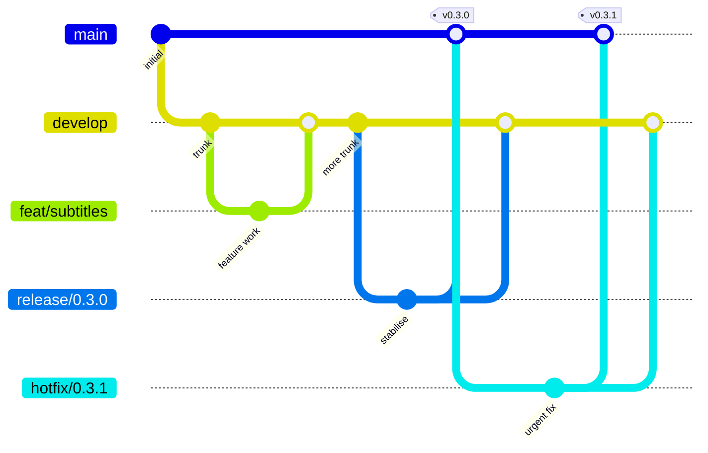
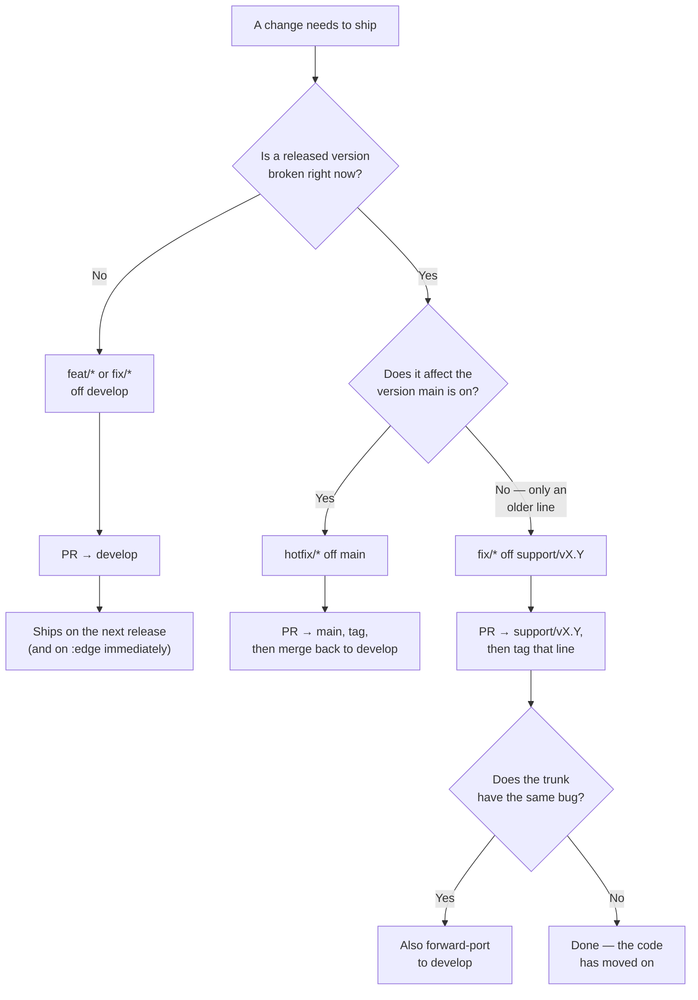

# Branching and release flow

How this repository branches, ships, and maintains older lines. The model is **GitFlow** as
originally defined — the same one the [Fallout VS Code
extension](https://github.com/Fallout-build/Fallout.Extensions.VSCode/blob/develop/docs/branching-and-release.md)
runs.

> **Audience.** Anyone opening a PR needs the [Branches](#branches) table and [Where work
> lands](#where-work-lands). The rest is maintainer material — see [releasing.md](releasing.md) for
> the runbooks and [ci.md](ci.md) for what CI does at each step.

## Branches

| Branch | Purpose | Lifetime | Tagged? |
|---|---|---|---|
| `develop` | **Integration trunk. Default branch.** All finished work lands here first. Every push republishes the [`:edge` images](releasing.md#the-edge-channel). | Permanent | No |
| `main` | **Production.** Only receives merges from `release/*` and `hotfix/*`, and every one of those is tagged. Never committed to directly. | Permanent | **Yes** |
| `release/*` | **Stabilisation window** for a release being prepared. Cut from `develop`; takes only fixes and release prep. Merges to `main` *and back to* `develop`, then deleted. | Short-lived | No (the merge into `main` is) |
| `hotfix/*` | **Urgent production fix.** Cut from `main`. Merges to `main` *and* `develop`, then deleted. | Short-lived | No (the merge into `main` is) |
| `support/vX.Y` | **Maintenance line** for an older release still being served after `main` moved on. Fixes only. **None exist today.** | Permanent once cut | **Yes** |
| `feat/*`, `fix/*`, `chore/*`, `docs/*` | Working branches — the prefixes this repo already uses. | PR-and-merge, then deleted | No |

The two permanent branches are the point of the whole model: **`main` answers "what is running on
people's NAS boxes" and `develop` answers "what is next"**, and they are always two refs you can
diff.

`master` is not used. `support/*` is deliberately *not* called `release/*` — in GitFlow that prefix
already means the temporary stabilisation branch, and overloading it makes every sentence about
"the release branch" ambiguous.

## The flow



Note both merge-backs into `develop`. **Skipping either is the classic GitFlow mistake** — the fix
ships to users and then vanishes on the next release, because the trunk never learned about it.

## Where work lands

Everything routine starts from `develop` and goes back to `develop`:

```bash
git switch develop && git pull --ff-only
git switch -c feat/my-change
# … work …
./build.sh Test
gh pr create --base develop --label enhancement
```

`develop` is the default branch, so `gh pr create` targets it without `--base`. Pass `--base`
explicitly anyway when you mean `main` or a support line, so the intent is on the record.

One category label per PR (`enhancement`, `bug`, `breaking-change`, `security`, `documentation`,
`dependencies`) or `skip-changelog` — the labels *are* the changelog, see
[`.github/release.yml`](../.github/release.yml) and
[issue-and-pr-style.md](agents/issue-and-pr-style.md).

## Which branch does a fix belong on?



A `support/*` fix is **not** automatically forward-ported: those lines exist precisely because the
trunk has moved on, so the same bug often doesn't exist there. Check rather than assume.

## Cutting a support line

`support/vX.Y` is cut **on demand, not preemptively** — the same rule Fallout applies to its
production lines
([ADR-0007](https://github.com/Fallout-build/Fallout/blob/main/docs/adr/0007-cut-release-branch-on-demand.md)).
A branch is created at the moment there is real work for it, not in anticipation.

For Krautwatch the trigger would be a release someone is stuck on. The realistic case is a
**breaking change to the deployment surface** — the compose topology, a config key, or the
Newznab/SABnzbd contract — where "just upgrade" is not a five-minute answer for someone whose
Sonarr is wired to a running instance.

```bash
git switch --detach v0.3.4          # the last good release on the old line
git switch -c support/v0.3
git push -u origin support/v0.3
```

CI needs no change: the gate already runs on PRs into `support/*`, and the release guard already
accepts tags reachable from one ([ci.md](ci.md)).

**There are no support lines today.** The project is pre-1.0 and everyone is expected to be on the
newest tag.

## Protection

| | `develop` | `main` | `support/*` |
|---|---|---|---|
| PR required | yes | yes | yes |
| `ubuntu-latest` check | required | required | required |
| Linear history | required | required | required |
| Force-push / delete | blocked | blocked | blocked |
| Admins exempt | yes | yes | yes |

No required reviewer count: this is a single-maintainer project, and a rule that cannot be
satisfied is a rule that gets bypassed. The required check is the real gate.

Tags matching `v*` are covered by a repository ruleset: creation, deletion and updates are blocked
for non-admins. That matters more here than in most repos — **every release channel is
tag-triggered**, so an accidental tag is an accidental release that publishes six images.

Admins are deliberately exempt, which keeps an escape hatch when a required check is stuck or a
release needs pushing through by hand.

## Merging

Linear history is enforced on every protected branch, so merge commits are out. Which of the two
remaining methods to use depends on the direction:

| Merging | Method | Why |
|---|---|---|
| `feat/*` → `develop` | **Squash** | Working branches accumulate WIP. One commit per landed change keeps the trunk readable. |
| `develop` → `main` | **Rebase** | Squashing would collapse an entire release into a single commit on the production branch, losing the per-change history — and the release notes are generated from the PRs that make it up. |
| `release/*` → `main` | **Rebase** | Same, and the individual stabilisation commits are what you cherry-pick back to `develop`. |
| `hotfix/*` → `main` | **Rebase** | Same — you need a real commit to port back. |
| anything → `develop` (port-back) | **Squash** | It's a working branch like any other. |

GitHub can't enforce a method per branch, so this is discipline rather than configuration. Both
methods stay enabled because both are correct somewhere.

### Why rebase across two long-lived branches is safe

Rebase-merge rewrites commits, so `main` never becomes an ancestor of `develop` — and once a hotfix
has landed on `main` and been ported back, the merge base falls behind both. The obvious worry is
that the *next* release would try to replay commits already present on `main`.

It doesn't. `git rebase` detects already-applied commits by patch-id and drops them, so a second
release replays only the genuinely new work.

The edge case to know: if a port-back was **conflict-resolved differently** from the original, its
patch no longer matches and rebase will try to apply it again. That surfaces as a conflict at
release time — visible and fixable, not silent.

### The double merge-back

A `release/*` or `hotfix/*` branch has to reach **two** branches. Because merge commits are
disabled, the second one is a cherry-pick or a fresh PR rather than a literal merge — see
[releasing.md](releasing.md#hotfix). The effect is what matters: a fix that never reaches `develop`
ships once and then disappears on the next release.

The one place reachability *is* asked about is the [release guard](ci.md#the-release-guard), which
checks `main` and `support/*` only — so the SHA divergence between the two branches costs us
nothing.

## See also

- [ci.md](ci.md) — what runs, when, and why there is no hand-written YAML in this repo
- [releasing.md](releasing.md) — channels, versioning, and every release runbook
- [The Fallout extension's model](https://github.com/Fallout-build/Fallout.Extensions.VSCode/blob/develop/docs/branching-and-release.md)
  — the same GitFlow, differing only where the artefact does: it ships a rolling VSIX pre-release
  where we ship a rolling image tag
