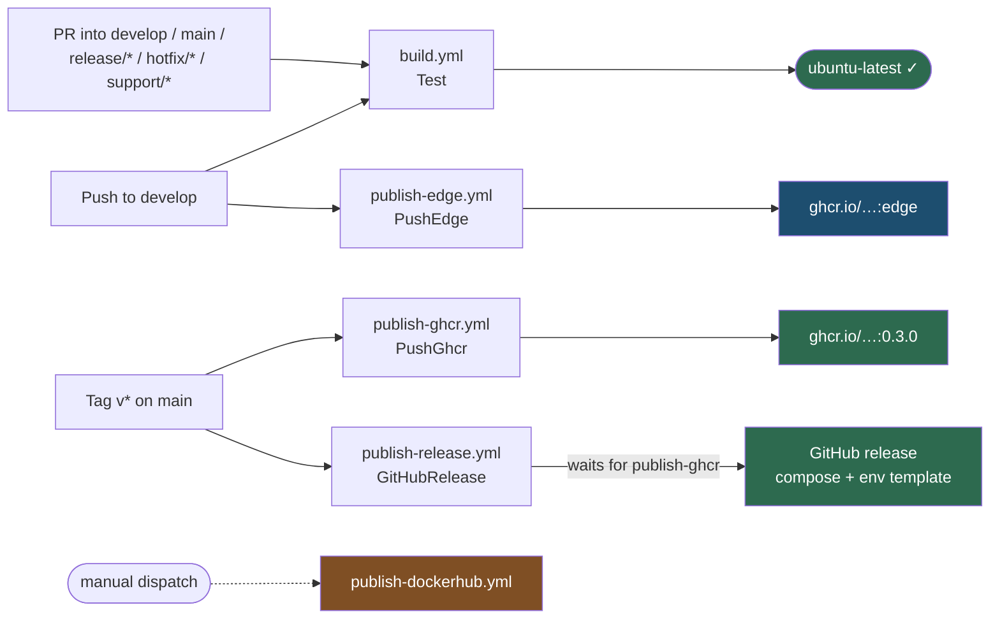
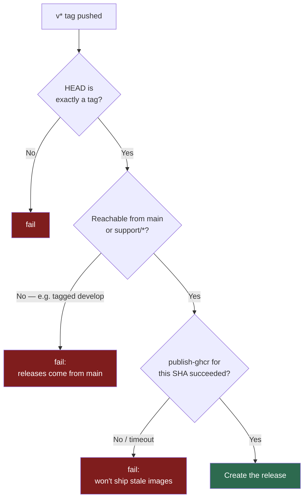

# CI/CD

What runs, when, and why it's shaped this way.

The governing principle: **the build is defined in C#, not in YAML.** Every workflow in this
repository is *generated* from a `[GitHubActions]` attribute in
[`build/Build.CI.GitHubActions.cs`](../build/Build.CI.GitHubActions.cs), and every step that
actually does something invokes a [Fallout](https://fallout.build) target. A workflow provisions a
runner and routes a channel; it never contains logic. That's why the same commands work identically
on a laptop and on a runner — and why you can rehearse a release locally before trusting CI with
it.

> **`.github/workflows/*.yml` is GENERATED. Never hand-edit it** — the next generation silently
> overwrites your change. Each file carries an `<auto-generated>` header saying so.

## The workflows

| File | Trigger | Invokes | Environment |
|---|---|---|---|
| `build.yml` | push to `develop`/`main`; PR into `develop`, `main`, `release/*`, `hotfix/*`, `support/*` | `Test` — the required check | — |
| `publish-edge.yml` | push to `develop` (non-docs) | `PushEdge` — rolling `:edge` images | `ghcr` |
| `publish-ghcr.yml` | `v*` tag | `PushGhcr` — versioned multi-arch images | `ghcr` |
| `publish-release.yml` | `v*` tag | `GitHubRelease` — compose bundle + notes | `github-release` |
| `publish-dockerhub.yml` | dispatch only | `PushDockerHub` — mirror | `dockerhub` |



## build.yml — the required check

Branch protection requires a status check named **`ubuntu-latest`**. That's the *job* name, not the
workflow name — protection keys on jobs, which is why the job is named after the image.

It runs `Test`, which compiles in Release and runs everything except `Category=Live`. The live
ARD/ZDF tests are excluded on purpose: they hit real broadcasters, drift, and rate-limit, so a gate
that included them would fail for reasons that have nothing to do with the PR. Run them deliberately
with `./build.sh TestLive`.

### Why there are no path filters on the gate

Excluding `**/*.md` looks like free savings and is a trap. The job name *is* the required status
check, so a docs-only PR would sit forever waiting on a check that never fires. The only fix is a
second workflow that reports the same context on the exact inverse path set — which is a
hand-written YAML file the generator cannot emit, and two path lists that must stay perfect
complements forever.

The extension repo pays that price because its gate packages a VSIX. Ours is a five-minute
`dotnet test`. We pay the five minutes.

`publish-edge.yml` *does* filter paths, and safely: it is not a required check, so a skipped run
blocks nothing.

## publish-edge.yml — the trunk channel

Every non-docs push to `develop` rebuilds the six service images for `linux/amd64` and
`linux/arm64` and pushes them to GHCR under `:edge`, replacing what was there. See
[releasing.md](releasing.md#the-edge-channel) for how to run it.

Two deliberate choices worth knowing when reading the attribute:

- **Concurrency queues, never cancels.** `ConcurrencyCancelInProgress` stays at its default
  `false`. A cancelled push can leave `:edge` pointing at a half-written manifest list, which is
  worse than an edge image running a few minutes behind the trunk.
- **`edge`, not `latest`.** `latest` is conventionally the newest *stable* image, and it is what a
  compose file falls back to when a tag is omitted — so naming the trunk channel `latest` would
  silently upgrade people who never asked for it. Anyone on `:edge` typed the word.

## The tag pipeline

A `v*` tag fires `publish-ghcr` and `publish-release` at the same moment. They are not independent:

`GitHubRelease` asserts three things before it publishes, and each one is a failure that was
actually observed rather than a hypothetical:

1. **`AssertTagged`** — HEAD is exactly a tag. A release built from an untagged commit is a release
   whose contents are not the tag it claims.
2. **`AssertReleasableRef`** *(new with GitFlow)* — the tag is reachable from `main` or a
   `support/*` line. Under GitFlow the trunk is never tagged for release; without this check that
   rule is documentation only, and breaking it is silent — a `v*` tag on `develop` would publish
   real images and a real release from unstabilised code.
3. **`AssertImagesPublishedForThisCommit`** — the sibling `publish-ghcr` run *for this exact SHA*
   has concluded successfully, and the manifests are readable. Asking the registry whether the tag
   exists is a different and weaker question: re-tagging a released version starts both workflows in
   the same second, the previous publish's images are already under that tag, and the release goes
   out pointing at stale images. That is exactly what happened on the v0.1.0 re-tag.

The wait is 30 minutes with a 20-second poll. Off CI there is no sibling run to wait on, so it falls
back to the existence check and says so in the log — a local release is a deliberate act.

### The release guard



The guard fetches `refs/heads/main` and `refs/heads/support/*` before asking, because a tag build
checks out a detached HEAD and the runner may know no branch refs at all — an unfetched containment
check would report "not on main" for a tag that plainly is.

## Environments hold the credentials

Each publish workflow is bound to a GitHub **environment** of the same name as its destination
(`ghcr`, `dockerhub`, `github-release`). The environment is what holds that destination's
credentials, so a token for one registry is never in scope for a push to another — and an
environment can later carry protection rules (required reviewers, tag filters) without any of that
leaking into the build definition.

Adding a registry is one more attribute plus an environment holding `REGISTRY_USER` and
`REGISTRY_PASSWORD`. No target changes.

Neither `ghcr` nor `github-release` currently has an approval rule, so a tag ships without a human
in the loop. If that ever stops being the right trade, add required reviewers to the environment —
not a condition in the build.

## Regenerating

After changing any `[GitHubActions]` attribute:

```bash
./build.sh --generate-configuration GitHubActions_build          --host GitHubActions
./build.sh --generate-configuration GitHubActions_publish-edge   --host GitHubActions
./build.sh --generate-configuration GitHubActions_publish-ghcr   --host GitHubActions
./build.sh --generate-configuration GitHubActions_publish-release --host GitHubActions
./build.sh --generate-configuration GitHubActions_publish-dockerhub --host GitHubActions
```

Commit the regenerated YAML with the attribute change — a diff where the two disagree is a
workflow that will be undone by whoever regenerates next.

## Running CI locally

There is no separate CI script. The runner invokes the same targets you do:

```bash
./build.sh Test                  # exactly what the PR gate runs
./build.sh TestLive              # the live ARD/ZDF tests the gate skips
./build.sh --help                # every target and parameter
./build.sh --plan                # the execution graph, rendered as HTML
./build.sh Compose               # generate docker-compose.yaml + .env from the AppHost
./build.sh ReleaseBundle         # build the release artefacts; publishes nothing
```

`ReleaseBundle` is the safe rehearsal for a release: it produces the compose file, the env template
and the notes into `.artifacts/release/` without touching GitHub.

## Gotchas

- **`fetch-depth: 0`** everywhere. The release targets ask git about tags and branch reachability;
  a shallow clone answers wrongly rather than failing.
- **`Test` needs Docker running** — `Infrastructure.Tests` starts a Postgres container via
  Testcontainers.
- **The compose file is generated from the Aspire AppHost**, not hand-written. Editing
  `.artifacts/compose/docker-compose.yaml` is pointless; change `AppHost/Program.cs` and
  regenerate (DR-003).
