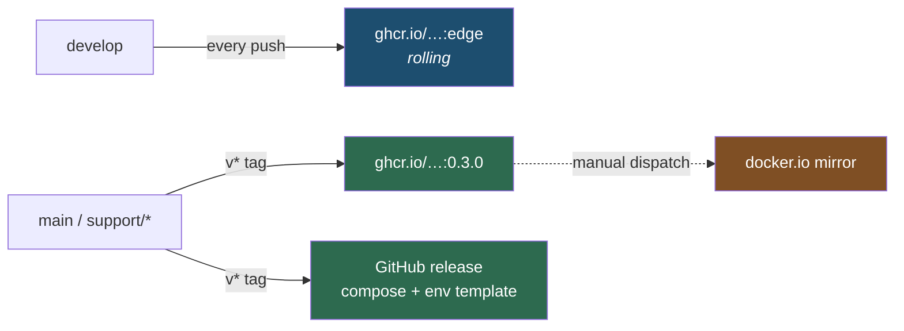
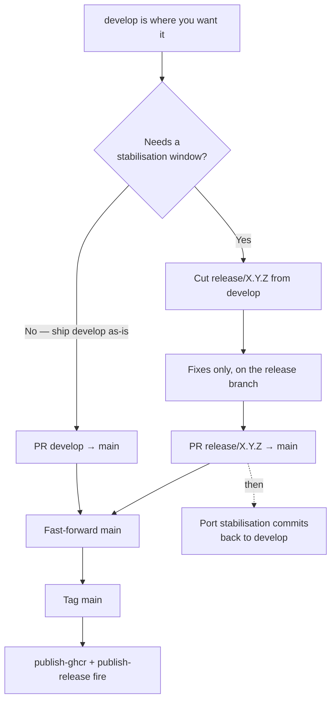

# Releasing

Channels, versioning, and the runbook for every kind of release. The branch model is in
[branching-and-release.md](branching-and-release.md); what CI does at each step is in
[ci.md](ci.md).

## Channels



| Channel | Trigger | Gating |
|---|---|---|
| `:edge` images | every non-docs push to `develop` | none |
| versioned images + GitHub release | any `v*` tag reachable from `main`/`support/*` | the [release guard](ci.md#the-release-guard) |
| Docker Hub mirror | manual dispatch | manual by definition |

## Versioning

Versions are **hand-picked semver tags**, `v<major>.<minor>.<patch>`, and the image tag is the
same string with the `v` stripped (`v0.3.0` → `:0.3.0`). Pre-1.0, so:

- **minor** — a new user-facing capability, or a change to the deployment surface (compose topology,
  a config key, the Newznab/SABnzbd contract) that needs a reader's attention.
- **patch** — fixes and internals.

There is deliberately **no Nerdbank.GitVersioning here**, unlike the Fallout repos. They need a
computed monotonic version because every preview build publishes a numbered package to a registry
that will not accept the same number twice. Our preview channel is a single rolling `:edge` tag with
no number in it, so the machinery would buy nothing and cost a `version.json` to keep honest.

## The edge channel

Every non-docs push to `develop` republishes all six images under `:edge`. That is the whole
channel: no release object, no version, just the trunk in runnable form.

To follow it, point an existing deployment's image tags at `edge`:

```bash
sed -i '' 's/:[0-9]\+\.[0-9]\+\.[0-9]\+$/:edge/' .env   # in a release bundle's .env
docker compose pull && docker compose up -d
```

`:edge` moves under you — that is the point, and it is why the tag is not called `latest`. Expect a
schema migration to land there before it lands in a release; the Migrator runs to completion on
every start, so an edge deployment upgrades itself, and **downgrading back to a release is not
supported**. Take a database backup before following the trunk with data you care about.

## Cutting a release



### Simple release — nothing to stabilise

```bash
git switch develop && git pull --ff-only
gh pr create --base main --title "Release v0.3.0" --label skip-changelog

# once the gate is green, advance main by FAST-FORWARD — not the merge button:
git switch main && git pull --ff-only
git merge --ff-only develop
git push origin main                       # this also marks the release PR merged
git tag v0.3.0 && git push origin v0.3.0
```

The tag push is the release. Watch it:

```bash
gh run watch $(gh run list --workflow publish-ghcr.yml --limit 1 --json databaseId --jq '.[0].databaseId')
gh release view v0.3.0
```

### With a stabilisation window

```bash
git switch -c release/0.3.0 develop
git push -u origin release/0.3.0
# … fixes land here by PR; feature work continues on develop …
gh pr create --base main
# fast-forward main onto release/0.3.0 and tag, as above, then port the fixes back:
git switch -c chore/port-0.3.0 develop
git cherry-pick <fix-sha>…
gh pr create --base develop --label skip-changelog
```

A `release/*` branch is cut from `develop`, so `main` fast-forwards onto it the same way. What does
*not* fast-forward is `develop` afterwards — hence the cherry-pick.

> **Do not use GitHub's merge button on a release PR.** It rewrites the commits even when the merge
> is a pure fast-forward, and the release notes are built from the commit→PR link that rewriting
> severs — v0.3.0 lost two entries to exactly this. Push a fast-forward instead. Reasoning and the
> hotfix-divergence case in [branching-and-release.md](branching-and-release.md#merging).

> **"Merge back to develop" is a cherry-pick or a second PR here**, not a literal merge. GitFlow
> assumes merge commits; this repo enforces linear history. The effect is the same — the fix must
> reach `develop`, or it ships once and disappears on the next release.

## Hotfix

A released version is broken and it can't wait for the next release.

```bash
git switch main && git pull --ff-only
git switch -c hotfix/0.3.1
# … fix …
gh pr create --base main --label bug
# merge, then:
git switch main && git pull --ff-only
git tag v0.3.1 && git push origin v0.3.1
```

Then get it onto the trunk — **this step is not optional**:

```bash
git switch -c fix/port-0.3.1 develop
git cherry-pick <fix-sha>
gh pr create --base develop --label skip-changelog
```

## Releasing from a support line

`support/vX.Y` serves an older release. Tags on it fire the same pipeline — the
[release guard](ci.md#the-release-guard) accepts `main` and `support/*` equally.

```bash
git switch support/v0.3 && git pull --ff-only
# … fix lands by PR …
git tag v0.3.5 && git push origin v0.3.5
```

Whether to forward-port is a judgement call: those lines exist because the trunk moved on, so the
same bug often doesn't exist there. Check, don't assume.

## What a release contains

`GitHubRelease` builds the artefacts rather than a human assembling them:

- **`docker-compose.yaml`** — generated from the Aspire AppHost, so the deployed topology cannot
  drift from the one the dev fleet runs (DR-003).
- **`env.example`** — the generated `.env` with every image reference rewritten to the published
  registry coordinates at this version, and **every secret blanked**. The generated file contains
  real working credentials; attaching it verbatim would publish them. Named without the leading dot
  because GitHub renames `.env.example` to `default.env.example` on upload, which would make the
  install instructions wrong.
- **Notes** — GitHub's generated changelog, grouped by PR label per
  [`.github/release.yml`](../.github/release.yml), with an install section appended.

Rehearse the whole thing without publishing anything:

```bash
./build.sh ReleaseBundle     # writes .artifacts/release/
```

## Release notes are the PR labels

There is no `CHANGELOG.md`. The notes are generated from merged PRs grouped by label, so improving
them is a matter of labelling PRs rather than writing release prose twice. That generation walks the
commits in the release and asks GitHub which PR each came from — which is why `main` must
[fast-forward](branching-and-release.md#why-main-advances-by-fast-forward-and-not-by-the-merge-button)
rather than be rewritten. One category label per
PR (`enhancement`, `bug`, `breaking-change`, `security`, `documentation`, `dependencies`), or
`skip-changelog` for housekeeping.

Note that `dependencies` and `skip-changelog` are both *excluded* from the notes — a PR carrying
`security` **and** `dependencies` vanishes entirely, so a CVE-fixing bump gets `security` alone.

## Mirroring to Docker Hub

Deliberately dispatch-only: Docker Hub is a mirror, and mirroring on every tag doubles the blast
radius of a bad release for no benefit.

```bash
gh workflow run publish-dockerhub.yml -f ImageTag=0.3.0
```

It needs a `dockerhub` environment holding `REGISTRY_USER` and `REGISTRY_PASSWORD`; there isn't one
yet, so the run fails fast on the missing parameter until it's created.

## If a publish fails partway

Both publish targets are idempotent on what already landed — re-pushing an image tag overwrites it,
and the release is created once:

```bash
gh run rerun <run-id> --failed
```

If the release object was created but the images weren't, delete the release *and its tag* before
re-tagging — a tag that already exists is not re-pushed, and `publish-ghcr` never fires again:

```bash
gh release delete v0.3.0 --cleanup-tag --yes
```
